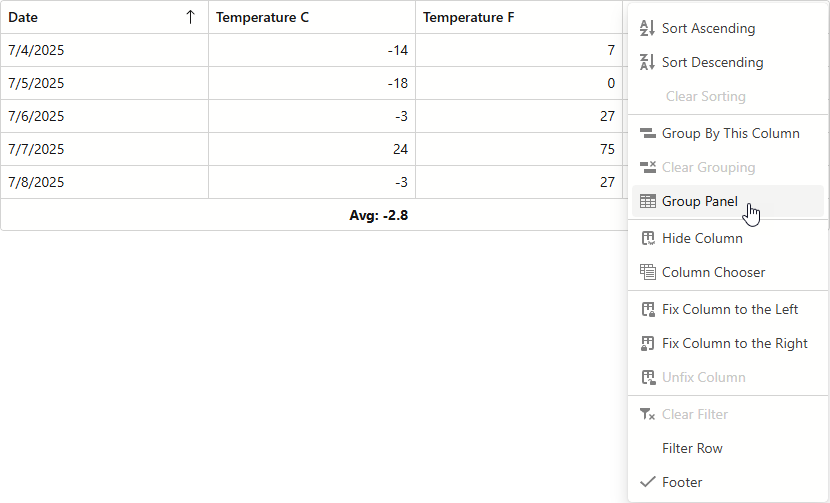

<!-- default badges list -->

<!-- default badges end -->

# Blazor Grid - Display a Context Menu

You can display a Context Menu when you right-click any Blazor Grid element. In this example, a click on a column header or row invokes the Context Menu.

Add the **oncontextmenu:preventDefault** to disable the standard browser context menu. In the Grid's [CustomizeElement](https://docs.devexpress.com/Blazor/DevExpress.Blazor.DxGrid.CustomizeElement) event handler, subscribe to the **contextmenu** event (displays the custom Context Menu).

The [GridContextMenuContainer](./CS/GridWithContextMenu/Pages/GridContextMenuContainer.razor) component contains Context Menu components. The [GridContextMenuHelper](./CS/GridWithContextMenu/Data/GridContextMenuHelper.cs) class implements Context Menu's item generation, manages state, and includes the click handlers that use the Blazor [Grid's API](https://docs.devexpress.com/Blazor/DevExpress.Blazor.DxGrid._methods) to execute commands.

## Files to Review

- [Index.razor](./CS/GridWithContextMenu/Pages/Index.razor)
- [GridContextMenuHelper.cs](./CS/GridWithContextMenu/Data/GridContextMenuHelper.cs)
- [GridContextMenuContainer.razor](./CS/GridWithContextMenu/Pages/GridContextMenuContainer.razor)

## Documentation

- [DxContextMenu](https://docs.devexpress.com/Blazor/DevExpress.Blazor.DxContextMenu)
- [DxGrid](https://docs.devexpress.com/Blazor/DevExpress.Blazor.DxGrid)

## Video

- [Adding a Context Menu to a Grid](https://www.youtube.com/watch?v=TfBR77ARnf8&t)

## More Examples

- [Blazor Data Grid - How to edit/delete the selected row by clicking on external buttons](https://github.com/DevExpress-Examples/blazor-DxDataGrid-edit-selected-row-by-clicking-on-external-button)
<!-- feedback -->
## Does this example address your development requirements/objectives?

 

(you will be redirected to DevExpress.com to submit your response)
<!-- feedback end -->
